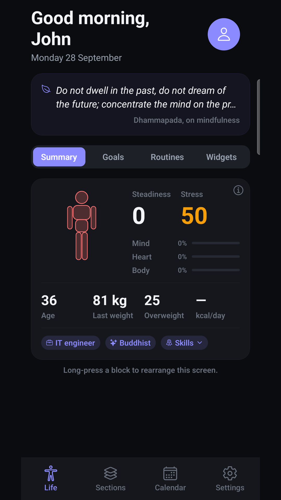
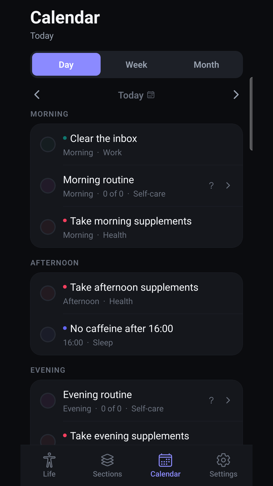
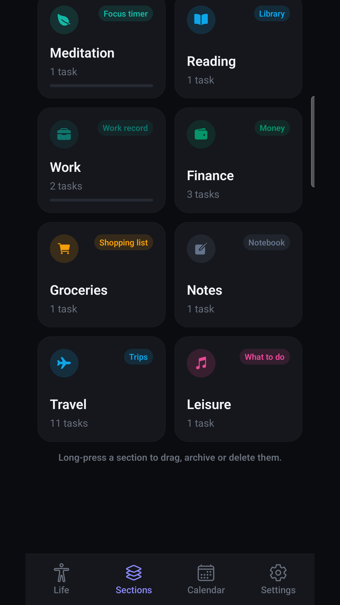
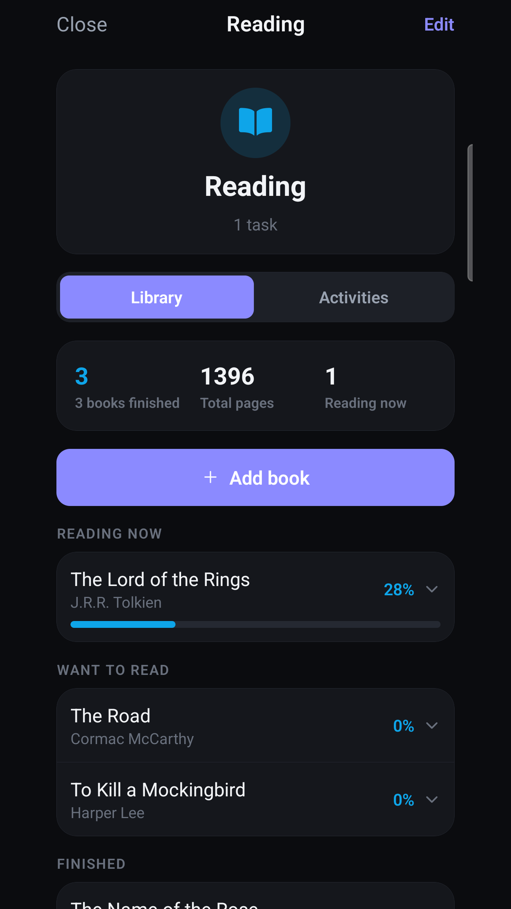

<!--
The README for the public showcase repository, kept here so it lives
beside the thing it describes and changes when that changes.

It is not this repository's own README: this one is private and talks to
whoever is working on the code. Copy this file into the public repo as
README.md, along with the four screenshots from `store/screenshots/`.

Written in English because the store listing's default language is
en-US. The store badges are linked to nothing until the listings exist;
the placeholder is the link, not the image, so that adding the URL later
is a one-line change.
-->

# Vitae: Life Organizer

**The simplest, cleanest, yet most complete way to define and organize your Life.**

Customizable. Offline. Yours.

 

&nbsp;

Android is in closed testing. iOS is on the way.

---

## What it is

Vitae starts by asking about you, then builds itself around the answers. You
choose which areas of your life matter, and the app organizes itself
accordingly instead of handing you a blank grid.

Organizing is **one** of the things it does, not the whole of it: every section
carries a tool of its own. The reading section has a library, the travel
section has trips and packing lists, the kitchen has meal plans and recipes,
the money section has income and outgoings.

## What it holds

Activities and habits, with the days they are due and an honest record of the
ones you kept. A daily check-in for sleep, energy and stress. Body measurements
over time. Notes on blood tests and supplements. Meals and recipes. A training
log. Books. Trips and packing lists. Income and outgoings. Goals with a photo.
Written notes. A calendar that pulls it all together.

You switch on only the sections you want. The rest stay out of the way, and you
can add your own.

## Everything stays on your phone

There is no account, no sign-in, and no server. Nothing you write is sent
anywhere and nothing is shared with anybody, including the advertiser. Your
notes, your measurements, your check-ins and your profile never leave the
device.

You can export a full backup yourself whenever you want. Uninstalling the app
deletes everything, because no copy exists anywhere else.

The full [privacy policy](https://gist.github.com/Artolink/27347fd2b357109db2dd91ff5637a7e5)
says the same thing in the detail a store listing asks for.

## Bilingual

English and Italian throughout, chosen by your phone's own setting and
changeable at any time. Both languages are written, not generated: a missing
translation stops the build rather than reaching a screen.

## Screenshots

## Built with

React Native and Expo, one codebase for iOS and Android. The rules that decide
what is due, when a week starts and how a streak survives a missed day are kept
in a layer of their own with no framework in it, which is what lets them be
argued about in tests rather than discovered on a phone.

## Source

**Vitae is not open source.** This repository is the project's public page: the
code lives in a private one. If you are interested in the app itself, the store
links above are the place to start.

## Contact

farneti.aa@gmail.com
